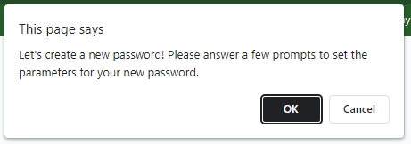
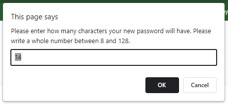
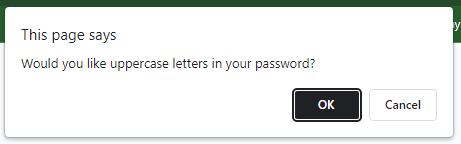
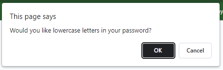
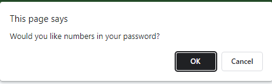
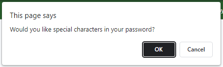
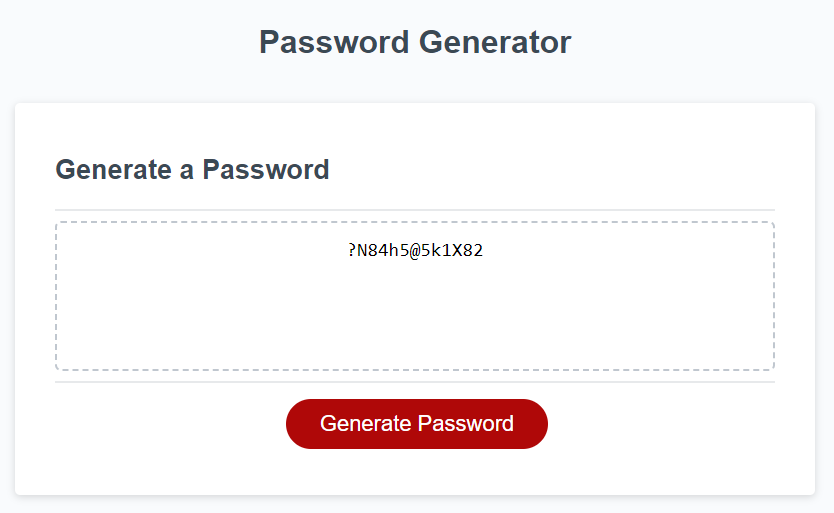
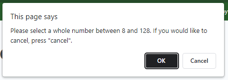
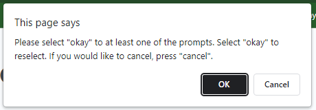

# Random Password Generator

## Description

In this project, I worked with existing code provided by The Coding Bootcamp on GitLab. I was motivated to add JavaScript to the existing code to give a user the ability to generate a random password.

This website was created for the purpose of giving the user a randomly generated password after a few simple questions. I updated this website to allow the buttons to work and for a password to be generated in the text box after the questions are answered.

Through the process of coding the password generator in JavaScript, I was able to learn more about arrays, functions, variables, and for loops. I also learned more about how to link the JavScript to interact with the HTML file. I was challenged to create variables that could be reused in functions and form arrays from existing arrays with for loops. Google and all the sources it provided were my best friends through this challenge.

Though I know it has much room for improvement, [here is a link to the webpage](https://sarah-paterson.github.io/Password-Generator-JavaScript/). My desire would be to come back to this particular web page and update the JavaScript so that the code works much more effectively.

---
---

## Table of Contents

- [Starting Code](#starting-code)
- [Usage](#usage)
- [Credits](#credits)
- [License](#license)

---
---

## Starting Code

The key to this project was to add JavaScript functionality to the existing HTML and CSS. Below is the image of the file as just HTML and CSS. As you can see visually, there are interactive parts to the code that have no function without JavaScript. With the new JavaScript, the **generate password** button will have an action once clicked, and a text box to present the new password in.

---

## Usage

The final website for the Password Generator should be used to create a new password. With the prompts, a new password can be generated. 

### Welcome Prompt

### Password Length Prompt
*Currently there is an error to be resolved. At present, the final password length will be short one value. If a value between 8-16 is chosen, it will be presented in 7-15 characters. Passwords above 17 will be shortened greatly and may not be generated.*

### Add Uppercase

### Add Lowercase

### Add Numbers

### Add Special Characters

Though the way the webpage is viewed has not changed visually, the prompts gather the information needed to create a randomized password. The final password will be generated in the text box based on the fields chosen. 
*Currently there is an error to be resolved. At present, the only option working is all options.*

### Final Password - All Options

If the input is not expected, then an error message will appear. There are two represented below.

### Error messages

---

## Credits
Starter code from this gitLab repository: https://git.bootcampcontent.com/University-of-Denver/DU-VIRT-FSF-PT-04-2023-U-LOLC/-/tree/main/03-JavaScript/02-Challenge

The Coding Bootcamp repositories for Boot Camp Curriculum Lesson Plans: https://github.com/coding-boot-camp

Shuffling JavaScript code provided by rohitsingh07052 via the website geeksforgeeks.org : https://www.geeksforgeeks.org/shuffle-a-given-array-using-fisher-yates-shuffle-algorithm/

Helpful Resources:
W3 School’s information about JavaScript: https://www.w3schools.com/js/default.asp
Stack Overflow’s answered questions about JavaScript: https://stackoverflow.com/
MDN’s information on JavaScript: https://developer.mozilla.org/en-US/
Google.com helping me find the above resources

The README template I used was provided by The Full-Stack Blog: https://coding-boot-camp.github.io/full-stack/github/professional-readme-guide

---

## License
MIT Licence

